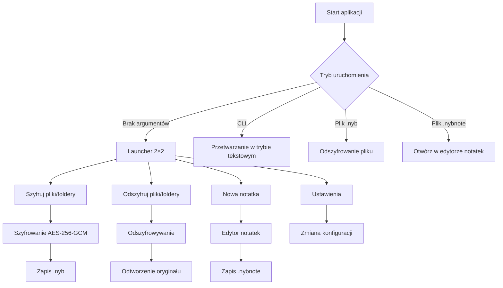

# NoteYourBusiness

**NoteYourBusiness** to aplikacja desktopowa dla **Windows 11** (Python 3.11 + PyQt6) do **szyfrowania plików, folderów i notatek** w bezpiecznym, własnym formacie (`.nyb` i `.nybnote`) z mocnym uwierzytelnieniem i wygodnym interfejsem opartym o HTML/CSS w PyQt WebEngine.

---

## 🎯 Cel projektu

- **Bezpieczne przechowywanie danych** – silne szyfrowanie AES-256-GCM z kluczem z Argon2id.
- **Wygodna obsługa** – prosty kreator szyfrowania/odszyfrowywania plików i folderów.
- **Prywatne notatki** – edytor notatek z automatycznym zapisem w formacie `.nybnote`.
- **Integracja z systemem** – menu kontekstowe Eksploratora Windows, skojarzenia plików, skróty.
- **Nowoczesny UI** – kafelkowy launcher 2×2 z ikonami i HTML/CSS/JS.

---

## 📊 Diagram przepływu aplikacji



---

## 📌 Funkcjonalności

### Szyfrowanie i odszyfrowywanie plików
- Algorytm: AES-256-GCM (96-bit nonce, unikalny per plik).
- Hasło przez Argon2id (mocne parametry, konfigurowalne).
- Integralność metadanych przez AAD w GCM.
- Zapis atrybutów plików i czasu modyfikacji.
- Ochrona przed podwójnym szyfrowaniem (`.nyb` i `.nybnote` pomijane).
- Opcja usuwania oryginału (Kosz/permanentnie).

### Edytor notatek
- Zapis tylko w `.nybnote`.
- Tytuł i data w metadanych.
- Skróty klawiaturowe, lista notatek, wyszukiwarka.

### Integracja z Windows
- Menu kontekstowe „Encrypt/Decrypt”.
- Skojarzenia `.nyb` → odszyfrowanie, `.nybnote` → otwarcie w edytorze.
- Nowa notatka z menu „Nowy”.

### Tryby uruchomienia
- **Bez argumentów** – launcher 2×2: Szyfruj / Odszyfruj / Notatka / Ustawienia.
- **CLI** – rozbudowane opcje (`--recursive`, `--dry-run`…).
- **Podwójny klik** – odpowiednia akcja dla `.nyb` lub `.nybnote`.

### Bezpieczeństwo
- AES-GCM + Argon2id, per-plik losowy salt i nonce.
- Integralność nagłówka (tag GCM obejmuje metadane).
- Brak zapisu haseł na dysku.
- Zerowanie kluczy w RAM po czasie bezczynności.
- Strumieniowe przetwarzanie dużych plików.

---

## 📂 Struktura projektu

```
noteyourbusiness/
├─ src/nyb/
│  ├─ main.py                # CLI + dispatcher do GUI
│  ├─ app.py                 # start GUI
│  ├─ gui/                   # interfejs PyQt6
│  │  ├─ web_launcher.py     # HTML launcher 2×2
│  │  ├─ encrypt_wizard.py   # kreator szyfrowania
│  │  ├─ decrypt_wizard.py   # kreator odszyfrowywania
│  │  ├─ note_editor.py      # edytor notatek
│  │  ├─ settings_dialog.py  # ustawienia
│  │  └─ progress_view.py    # pasek postępu + tabela wyników
│  ├─ core/                  # logika biznesowa
│  │  ├─ crypto.py           # AES-GCM, Argon2id
│  │  ├─ header.py           # format kontenera, AAD
│  │  ├─ io.py               # zapis atomowy, strumienie
│  │  ├─ walker.py           # rekursja, wykluczenia
│  │  ├─ metadata.py         # atrybuty plików
│  │  ├─ recycle.py          # Kosz
│  │  ├─ password_cache.py   # cache kluczy w RAM
│  │  └─ errors.py           # wyjątki domenowe
│  ├─ config/
│  │  ├─ manager.py
│  │  └─ schema.py
│  ├─ shell/                 # integracja z Windows
│  │  ├─ file_associations.py
│  │  └─ context_menu.py
│  └─ utils/
│     ├─ paths.py
│     ├─ concurrency.py
│     └─ naming.py
├─ assets/gui/
│  ├─ launcher.html
│  ├─ encrypt.html
│  ├─ decrypt.html
│  └─ style.css
├─ tests/
│  ├─ test_crypto.py
│  ├─ test_header.py
│  ├─ test_io.py
│  └─ test_roundtrip.py
├─ requirements.txt
├─ pyproject.toml
└─ README.md
```

---

## 📅 Plan sprintów

| Sprint | Zadanie | Status |
|--------|---------|--------|
| 0 | Skeleton projektu + stuby | ✅ |
| 1 | Format nagłówka + AAD | 🔄 |
| 2 | Strumieniowy AES-GCM + zapis atomowy | ⏳ |
| 3 | CLI + raporty | ⏳ |
| 4 | Edytor `.nybnote` + integracja GUI | ⏳ |
| 5 | Integracja Windows (menu, skojarzenia) | ⏳ |
| 6 | Usprawnienia (retry, kosz, i18n, logi) | ⏳ |
| 7 | Instalator Inno Setup + podpis | ⏳ |

---

## 🤝 Zasady współpracy

- **Ty**: testujesz, zgłaszasz uwagi, opisujesz błędy.  
- **Ja**: analizuję uwagi, piszę gotowy kod, tłumaczę co i gdzie wkleić.  

**Workflow Git**:
```bash
git add .
git commit -m "opis zmiany"
git push
```
- `main` – stabilna wersja.  
- `dev` – prace bieżące.  

**Komunikacja**:
- Krótkie sprinty, małe PR-y.  
- Każdy bug/feature jako osobne issue.  
- Ty wrzucasz przypadki testowe → ja dopisuję testy.

---

## 📌 Repozytorium GitHub

- **Code** – źródła projektu (`src/`, `assets/`, `tests/`).  
- **Issues** – lista zadań i bugów.  
- **Pull Requests** – zmiany do weryfikacji.  
- **Actions** – CI: lint + testy.  

Historia commitów pokazuje rozwój projektu krok po kroku.

---

## 🔐 Szczegóły techniczne bezpieczeństwa

- AES-256-GCM, nonce 96-bit, salt 128-bit.  
- Klucz z Argon2id (m_cost, t_cost, parallelism konfigurowalne).  
- Per-plik losowe nonce/salt.  
- Integralność: tag GCM obejmuje cały nagłówek JSON (bez pola tagu).  
- Klucze w pamięci RAM maks. 10 min od ostatniego użycia.

---

## 📦 Dystrybucja

- **Budowanie**: `PyInstaller --onedir`  
- **Instalator**: Inno Setup (per-user).  
- Skojarzenia plików i menu kontekstowe w rejestrze HKCU.  
- Podpis cyfrowy zalecany (SmartScreen).

---

## 🚀 Jak zacząć

```bash
git clone <repo>
cd noteyourbusiness
python -m venv .venv
.venv\Scripts\activate
pip install -r requirements.txt
python -m nyb.main
```

---

## 🧪 Testy

Uruchom wszystkie testy:

```bash
pytest
```

Scenariusze obejmują:
- Round-trip plików 0 B, 1 B, 4 KiB, Unicode, długie ścieżki.
- Błędne hasło, uszkodzone pliki, kolizje nazw.
- Rekursja z wykluczeniami, pomijanie symlinków.

---

## 📜 Licencja

MIT / do ustalenia.
